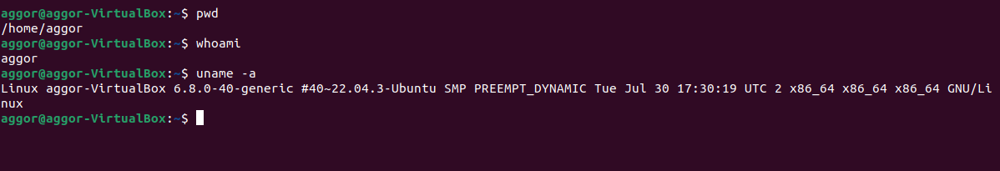

# Let's Learn Linux — Assignment 1
**ParoCyber DevSecOps Bootcamp**
**Name:** Emmanuel Selasie Aggor
**GitHub Repo:** [lets-learn-linux-1](https://github.com/emmanuelaggor/lets-learn-linux-1)

## SECTION 1 - Orient Yourself

### Q1 - Print current directory, username, and OS/kernel details (3 marks)

**Commands run:**
```bash
pwd
whoami
uname -a
```

**Screenshot:** 

**Answers:**

- `pwd` (Print Working Directory) tells you the full path of the directory you are currently in. On a new SSH session this confirms where the shell has landed -important because scripts, relative paths, and log files all depend on your current location.

- `whoami` tells you the username of the currently logged-in user. A DevSecOps engineer needs to know this immediately: running as `root` by accident on a production server is a serious security risk, and many commands behave differently depending on privilege level.

- `uname -a` prints full system information - kernel name, hostname, kernel version, build date, machine hardware, and OS. The kernel version is critical for CVE checks: if the server is running an old kernel (e.g. `Linux 4.x`), it may be vulnerable to known exploits like Dirty COW (CVE-2016-5195) or Spectre/Meltdown variants. A DevSecOps engineer cross-references this version against vulnerability databases (NVD, CVE Details) before touching the server.

- **Why these three first when SSHing into an unknown server:**
These three commands answer: *Where am I? Who am I? What am I on?* -without them, any action you take is blind. The kernel version alone can reveal whether the server is a sitting target for privilege escalation exploits.

---
### Q2 — List the root directory

**command run:**
```bash
ls /
```

**Five directories and their purposes:**
 
| Directory | Purpose |
|-----------|---------|
| `/etc` | System-wide configuration files - network settings, user accounts, service configs. A DevSecOps engineer checks here for misconfigurations. |
| `/var` | Variable data that changes at runtime -logs (`/var/log`), mail spools, databases. Critical for log analysis during incidents. |
| `/home` | Home directories for regular users. Contains user files, bash history, SSH keys. |
| `/bin` | Essential user binaries (commands like `ls`, `cp`, `cat`). Available to all users, needed even in single-user/recovery mode. |
| `/tmp` | Temporary files, world-writable. Attackers often use this to stage malicious files - a key directory to monitor. |

**What is the Filesystem Hierarchy Standard (FHS)?**
The FHS is a specification that defines the directory structure and content of Linux/Unix systems. It standardises where different types of files live so that software, scripts, and administrators can reliably find them regardless of which Linux distribution is in use.
 
**What breaks on a shared production server without it?**
Without FHS: automated deployment scripts that assume `/etc/nginx/` or `/var/log/` break silently; log agents (like Filebeat or Splunk forwarders) cannot find log paths; security monitoring tools (IDS/SIEM) fail to collect events; and multiple engineers working on the same server cannot predict where configuration or data files are - causing dangerous inconsistencies in a production environment.

---

### Q3 - List home directory with and without hidden files

**Commands run:**
```bash
ls ~
ls -la ~
```
**Screenshot:** 
