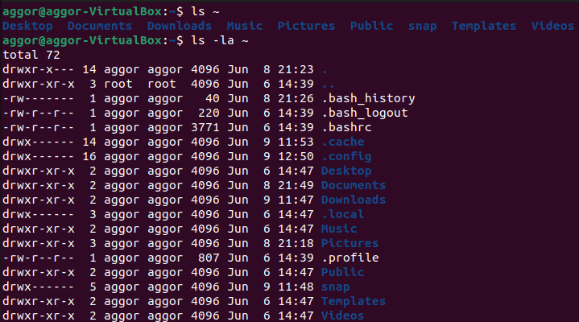
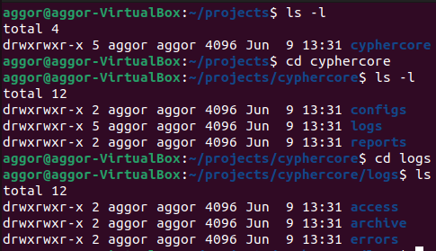
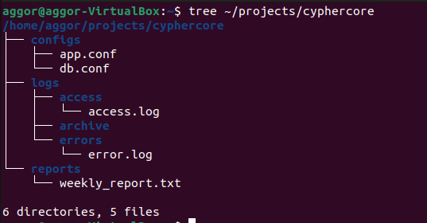

# Let's Learn Linux - Assignment 1
**ParoCyber DevSecOps Bootcamp**
**Name:** Emmanuel Selasie Aggor
**GitHub Repo:** [lets-learn-linux-1](https://github.com/emmanuelaggor/lets-learn-linux-1)

## SECTION 1 - Orient Yourself

### Q1 - Print current directory, username, and OS/kernel details (3 marks)

**Commands run:**
```bash
pwd
whoami
uname -a
```

**Screenshot:** 

**Answers:**

- `pwd` (Print Working Directory) tells you the full path of the directory you are currently in. On a new SSH session this confirms where the shell has landed -important because scripts, relative paths, and log files all depend on your current location.

- `whoami` tells you the username of the currently logged-in user. A DevSecOps engineer needs to know this immediately: running as `root` by accident on a production server is a serious security risk, and many commands behave differently depending on privilege level.

- `uname -a` prints full system information - kernel name, hostname, kernel version, build date, machine hardware, and OS. The kernel version is critical for CVE checks: if the server is running an old kernel (e.g. `Linux 4.x`), it may be vulnerable to known exploits like Dirty COW (CVE-2016-5195) or Spectre/Meltdown variants. A DevSecOps engineer cross-references this version against vulnerability databases (NVD, CVE Details) before touching the server.

**Why these three first when SSHing into an unknown server:**
These three commands answer: *Where am I? Who am I? What am I on?* -without them, any action you take is blind. The kernel version alone can reveal whether the server is a sitting target for privilege escalation exploits.

---
### Q2 - List the root directory

**command run:**
```bash
ls /
```

**Five directories and their purposes:**
 
| Directory | Purpose |
|-----------|---------|
| `/etc` | System-wide configuration files - network settings, user accounts, service configs. A DevSecOps engineer checks here for misconfigurations. |
| `/var` | Variable data that changes at runtime -logs (`/var/log`), mail spools, databases. Critical for log analysis during incidents. |
| `/home` | Home directories for regular users. Contains user files, bash history, SSH keys. |
| `/bin` | Essential user binaries (commands like `ls`, `cp`, `cat`). Available to all users, needed even in single-user/recovery mode. |
| `/tmp` | Temporary files, world-writable. Attackers often use this to stage malicious files - a key directory to monitor. |

**What is the Filesystem Hierarchy Standard (FHS)?**
The FHS is a specification that defines the directory structure and content of Linux/Unix systems. It standardises where different types of files live so that software, scripts, and administrators can reliably find them regardless of which Linux distribution is in use.
 
**What breaks on a shared production server without it?**
Without FHS: automated deployment scripts that assume `/etc/nginx/` or `/var/log/` break silently; log agents (like Filebeat or Splunk forwarders) cannot find log paths; security monitoring tools (IDS/SIEM) fail to collect events; and multiple engineers working on the same server cannot predict where configuration or data files are - causing dangerous inconsistencies in a production environment.

---

### Q3 - List home directory with and without hidden files

**Commands run:**
```bash
ls ~
ls -la ~
```
**Screenshot:** 

**What is different between the two outputs?**
The second command (`ls -la`) reveals hidden files and directories - those whose names begin with a `.` (dot). It also shows full details: file permissions, number of hard links, owner, group, file size in bytes, last modified date, and filename. The first command (`ls`) shows only non-hidden files and no metadata.
 
**What makes a file hidden in Linux?**
A file is hidden simply by naming it with a `.` prefix (e.g. `.bashrc`). It is not a special file type, not encrypted, not protected - it is purely a naming convention. The `ls` command omits dot-files by default, but they are fully visible with `-a`.
 
**Two real hidden files in a home directory:**
 
1. **`.bashrc`** - A shell script that runs every time a new interactive terminal session opens. It sets environment variables, aliases, and custom prompt settings. Attackers may modify this file to establish persistence - every time the user opens a terminal, malicious code runs.
2. **`.ssh/`** (directory) - Contains SSH keys: `id_rsa` (private key), `id_rsa.pub` (public key), and `authorized_keys` (which remote machines this user can log into). Compromising this directory gives an attacker passwordless access to any server the user has configured.

---

## SECTION 2 - Build the Environment

### Q4 — Create the full directory structure in one command

**Command run:**
```bash
mkdir -p ~/projects/cyphercore/{configs,logs/{access,errors,archive},reports}
```

**Screenshot (tree output):** 
 
**Answers:**
 
**The `-p` flag:** Stands for "parents." It tells `mkdir` to create all intermediate directories in the path if they don't already exist, and to not throw an error if a directory already exists. Without `-p`, you would need to create each directory level one at a time.
 
**Brace expansion:** Brace expansion is a Bash feature that generates multiple strings from a single expression. `{configs,logs,reports}` expands to three separate paths. Nested braces like `logs/{access,errors,archive}` expand to `logs/access`, `logs/errors`, and `logs/archive`. Bash performs this expansion before the command runs, so `mkdir` receives all paths at once.
 
**Could you do this without brace expansion?**
Yes — you could run `mkdir -p` multiple times, once per directory. But that is slower, more error-prone (you might miss a subdirectory), and impossible to do in a true single command. In a script that provisions infrastructure for dozens of clients, brace expansion keeps code concise and auditable.
 
---
 
### Q5 - Create five empty placeholder files in one command (4 marks)
 
**Command run:**
```bash
touch configs/app.conf configs/db.conf logs/access/access.log logs/errors/error.log reports/weekly_report.txt
```
 
**Answers:**
 
**What does `touch` do beyond creating files?**
`touch` updates the **access timestamp** and **modification timestamp** (mtime) of a file to the current time. If the file does not exist, it creates it as an empty file. If it does exist, only the timestamps change - the content is untouched.
 
**What happens if you run it on an existing file?**
The file content is preserved but its timestamps are updated. Running `ls -l` before and after shows that the "last modified" date/time changes even though the file size remains the same (still 0 bytes for a new file, or whatever it was for an existing one).
 
**Why does this matter in automation scripts?**
Many automation tools (Make, Ansible, build systems) use timestamps to decide whether a file needs to be reprocessed. `touch` lets you "fake" a modification to trigger a rebuild without changing content. In log rotation and pipeline scripts, accidentally overwriting a file with `>` instead of using `touch` would destroy data - understanding `touch` helps engineers choose the right tool for the right job.
 
---
 
### Q6 - List configs/ in long format with human-readable sizes (3 marks)
 
**Command run:**
```bash
ls -lh ~/projects/cyphercore/configs/
```
 
**Answers:**
 
**What do the file sizes tell you?**
Both `app.conf` and `db.conf` show a size of `0` (or `0B` with `-h`). This confirms they are empty placeholder files - they exist in the filesystem with valid inodes but contain no data yet. This is expected at this stage; scripts can check for their existence without needing content.
 
**Permission string breakdown** (example: `-rw-r--r--`):
 
| Character(s) | Meaning |
|---|---|
| `-` | File type: `-` = regular file, `d` = directory, `l` = symlink |
| `rw-` | Owner permissions: read ✓, write ✓, execute ✗ |
| `r--` | Group permissions: read ✓, write ✗, execute ✗ |
| `r--` | Others permissions: read ✓, write ✗, execute ✗ |
 
**What does `-h` add?**
The `-h` (human-readable) flag converts raw byte counts into readable units - bytes, KB, MB, GB - instead of showing raw numbers. For example, a 1048576-byte file shows as `1.0M`. Essential when scanning a log directory to quickly spot abnormally large files.
 
---

### Q7 — Display full tree of ~/projects/cyphercore (3 marks)
 
**Command run:**
```bash
tree ~/projects/cyphercore
```
 
**Screenshot:** 
 
**Answers:**
 
**How is `tree` different from `ls -R`?**
`ls -R` recursively lists directories but outputs them as flat text blocks — each subdirectory is listed separately with its path as a header, making the structure hard to read. `tree` renders the same information as a visual branching diagram with indentation and connecting lines, making the hierarchy immediately clear at a glance.
 
**When would a DevSecOps engineer run `tree` on a live server?**
- During **incident response** to quickly map an unfamiliar application's directory layout and spot unexpected files or directories (e.g. a hidden `.git` folder in `/var/www/` or unusual binaries in `/tmp/`)
- During **configuration audits** to verify that a deployment matches the expected structure before handing off to staging
- When **investigating a compromised server** to identify new directories created by an attacker that shouldn't be there
---
