# Let's Learn Linux - Assignment 1
**ParoCyber DevSecOps Bootcamp**
**Name:** Emmanuel Selasie Aggor
**GitHub Repo:** [lets-learn-linux-1](https://github.com/emmanuelaggor/lets-learn-linux-1)

## SECTION 1 - Orient Yourself

### Q1 - Print current directory, username, and OS/kernel details (3 marks)

**Commands run:**
```bash
pwd
whoami
uname -a
```

**Screenshot:** 

**Answers:**

- `pwd` (Print Working Directory) tells you the full path of the directory you are currently in. On a new SSH session this confirms where the shell has landed -important because scripts, relative paths, and log files all depend on your current location.

- `whoami` tells you the username of the currently logged-in user. A DevSecOps engineer needs to know this immediately: running as `root` by accident on a production server is a serious security risk, and many commands behave differently depending on privilege level.

- `uname -a` prints full system information - kernel name, hostname, kernel version, build date, machine hardware, and OS. The kernel version is critical for CVE checks: if the server is running an old kernel (e.g. `Linux 4.x`), it may be vulnerable to known exploits like Dirty COW (CVE-2016-5195) or Spectre/Meltdown variants. A DevSecOps engineer cross-references this version against vulnerability databases (NVD, CVE Details) before touching the server.

**Why these three first when SSHing into an unknown server:**
These three commands answer: *Where am I? Who am I? What am I on?* -without them, any action you take is blind. The kernel version alone can reveal whether the server is a sitting target for privilege escalation exploits.

---
### Q2 - List the root directory

**command run:**
```bash
ls /
```

**Five directories and their purposes:**
 
| Directory | Purpose |
|-----------|---------|
| `/etc` | System-wide configuration files - network settings, user accounts, service configs. A DevSecOps engineer checks here for misconfigurations. |
| `/var` | Variable data that changes at runtime -logs (`/var/log`), mail spools, databases. Critical for log analysis during incidents. |
| `/home` | Home directories for regular users. Contains user files, bash history, SSH keys. |
| `/bin` | Essential user binaries (commands like `ls`, `cp`, `cat`). Available to all users, needed even in single-user/recovery mode. |
| `/tmp` | Temporary files, world-writable. Attackers often use this to stage malicious files - a key directory to monitor. |

**What is the Filesystem Hierarchy Standard (FHS)?**
The FHS is a specification that defines the directory structure and content of Linux/Unix systems. It standardises where different types of files live so that software, scripts, and administrators can reliably find them regardless of which Linux distribution is in use.
 
**What breaks on a shared production server without it?**
Without FHS: automated deployment scripts that assume `/etc/nginx/` or `/var/log/` break silently; log agents (like Filebeat or Splunk forwarders) cannot find log paths; security monitoring tools (IDS/SIEM) fail to collect events; and multiple engineers working on the same server cannot predict where configuration or data files are - causing dangerous inconsistencies in a production environment.

---

### Q3 - List home directory with and without hidden files

**Commands run:**
```bash
ls ~
ls -la ~
```
**Screenshot:** 

**What is different between the two outputs?**
The second command (`ls -la`) reveals hidden files and directories - those whose names begin with a `.` (dot). It also shows full details: file permissions, number of hard links, owner, group, file size in bytes, last modified date, and filename. The first command (`ls`) shows only non-hidden files and no metadata.
 
**What makes a file hidden in Linux?**
A file is hidden simply by naming it with a `.` prefix (e.g. `.bashrc`). It is not a special file type, not encrypted, not protected - it is purely a naming convention. The `ls` command omits dot-files by default, but they are fully visible with `-a`.
 
**Two real hidden files in a home directory:**
 
1. **`.bashrc`** - A shell script that runs every time a new interactive terminal session opens. It sets environment variables, aliases, and custom prompt settings. Attackers may modify this file to establish persistence - every time the user opens a terminal, malicious code runs.
2. **`.ssh/`** (directory) - Contains SSH keys: `id_rsa` (private key), `id_rsa.pub` (public key), and `authorized_keys` (which remote machines this user can log into). Compromising this directory gives an attacker passwordless access to any server the user has configured.

---

## SECTION 2 - Build the Environment

### Q4 — Create the full directory structure in one command

**Command run:**
```bash
mkdir -p ~/projects/cyphercore/{configs,logs/{access,errors,archive},reports}
```

**Screenshot (tree output):** 
 
**Answers:**
 
**The `-p` flag:** Stands for "parents." It tells `mkdir` to create all intermediate directories in the path if they don't already exist, and to not throw an error if a directory already exists. Without `-p`, you would need to create each directory level one at a time.
 
**Brace expansion:** Brace expansion is a Bash feature that generates multiple strings from a single expression. `{configs,logs,reports}` expands to three separate paths. Nested braces like `logs/{access,errors,archive}` expand to `logs/access`, `logs/errors`, and `logs/archive`. Bash performs this expansion before the command runs, so `mkdir` receives all paths at once.
 
**Could you do this without brace expansion?**
Yes — you could run `mkdir -p` multiple times, once per directory. But that is slower, more error-prone (you might miss a subdirectory), and impossible to do in a true single command. In a script that provisions infrastructure for dozens of clients, brace expansion keeps code concise and auditable.
 
---
 
### Q5 - Create five empty placeholder files in one command
 
**Command run:**
```bash
touch configs/app.conf configs/db.conf logs/access/access.log logs/errors/error.log reports/weekly_report.txt
```
 
**Answers:**
 
**What does `touch` do beyond creating files?**
`touch` updates the **access timestamp** and **modification timestamp** (mtime) of a file to the current time. If the file does not exist, it creates it as an empty file. If it does exist, only the timestamps change - the content is untouched.
 
**What happens if you run it on an existing file?**
The file content is preserved but its timestamps are updated. Running `ls -l` before and after shows that the "last modified" date/time changes even though the file size remains the same (still 0 bytes for a new file, or whatever it was for an existing one).
 
**Why does this matter in automation scripts?**
Many automation tools (Make, Ansible, build systems) use timestamps to decide whether a file needs to be reprocessed. `touch` lets you "fake" a modification to trigger a rebuild without changing content. In log rotation and pipeline scripts, accidentally overwriting a file with `>` instead of using `touch` would destroy data - understanding `touch` helps engineers choose the right tool for the right job.
 
---
 
### Q6 - List configs/ in long format with human-readable sizes
 
**Command run:**
```bash
ls -lh ~/projects/cyphercore/configs/
```
 
**Answers:**
 
**What do the file sizes tell you?**
Both `app.conf` and `db.conf` show a size of `0` (or `0B` with `-h`). This confirms they are empty placeholder files - they exist in the filesystem with valid inodes but contain no data yet. This is expected at this stage; scripts can check for their existence without needing content.
 
**Permission string breakdown** (example: `-rw-r--r--`):
 
| Character(s) | Meaning |
|---|---|
| `-` | File type: `-` = regular file, `d` = directory, `l` = symlink |
| `rw-` | Owner permissions: read ✓, write ✓, execute ✗ |
| `r--` | Group permissions: read ✓, write ✗, execute ✗ |
| `r--` | Others permissions: read ✓, write ✗, execute ✗ |
 
**What does `-h` add?**
The `-h` (human-readable) flag converts raw byte counts into readable units - bytes, KB, MB, GB - instead of showing raw numbers. For example, a 1048576-byte file shows as `1.0M`. Essential when scanning a log directory to quickly spot abnormally large files.
 
---

### Q7 - Display full tree of ~/projects/cyphercore
 
**Command run:**
```bash
tree ~/projects/cyphercore
```
 
**Screenshot:** 
 
**Answers:**
 
**How is `tree` different from `ls -R`?**
`ls -R` recursively lists directories but outputs them as flat text blocks - each subdirectory is listed separately with its path as a header, making the structure hard to read. `tree` renders the same information as a visual branching diagram with indentation and connecting lines, making the hierarchy immediately clear at a glance.
 
**When would a DevSecOps engineer run `tree` on a live server?**
- During **incident response** to quickly map an unfamiliar application's directory layout and spot unexpected files or directories (e.g. a hidden `.git` folder in `/var/www/` or unusual binaries in `/tmp/`)
- During **configuration audits** to verify that a deployment matches the expected structure before handing off to staging
- When **investigating a compromised server** to identify new directories created by an attacker that shouldn't be there
---
## SECTION 3 - Write and Read Files 
 
### Q8 - Append three log lines to access.log
 
**Commands run:**
```bash
echo "2025-06-02 08:14:33 INFO  Application started successfully" >> logs/access/access.log
echo "2025-06-02 08:14:55 WARN  High memory usage detected: 87%" >> logs/access/access.log
echo "2025-06-02 08:15:10 ERROR Database connection timeout — retrying (attempt 1/3)" >> logs/access/access.log
cat logs/access/access.log
```
 
**Screenshot:** 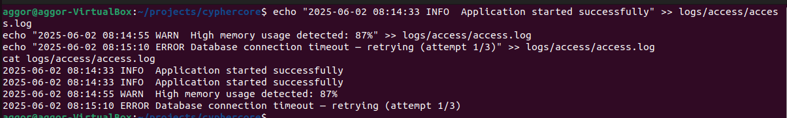
 
**Answers:**
 
**Difference between `>` and `>>`:**
- `>` **overwrites** - it truncates the file to zero bytes and writes fresh content. If the file doesn't exist, it creates it.
- `>>` **appends** - it adds new content to the end of the existing file. If the file doesn't exist, it creates it.
**Demonstration:**
Running `echo "2025-06-02 08:14:33 INFO  Application started successfully" > logs/access/access.log` with `>` destroys the other two lines - the file now contains only that one line. The first two appended lines are permanently gone.
 
**Why is confusing these dangerous in a production log rotation script?**
A log rotation script that uses `>` instead of `>>` to write a new log entry would silently wipe the entire existing log file -destroying evidence of every event that occurred before that moment. In a security incident, this could erase the audit trail needed for forensic investigation, compliance reporting, or legal proceedings. The mistake is silent - no error is thrown, the file still exists, it just has no useful history.
 
---

### Q9 - Display access log from top and bottom 
 
**Commands run:**
```bash
cat logs/access/access.log
tac logs/access/access.log
```
 
**Answers:**
 
**Difference between the two:**
- `cat` (concatenate) reads and prints a file from the **first line to the last** - top to bottom, in chronological order for log files.
- `tac` is `cat` reversed - it prints from the **last line to the first**. The name is literally "cat" backwards.
**Which to reach for first in a real incident with an 80,000-line log?**
`tac` - or more precisely, `tail`. In a live incident, the most recent events are what matter. Reading 80,000 lines from the top means scrolling through hours of normal activity before reaching the moment things went wrong. Starting from the bottom puts you immediately at the most recent (and most relevant) events.

**Third command that shows only the last 10 lines:**
```bash
tail logs/access/access.log
```
`tail` defaults to the last 10 lines. Use `tail -n 50` for the last 50, or `tail -f` to **follow** a log in real time - essential during active incident monitoring.
 
---

**Command run:**
```bash
cat >> logs/errors/error.log << EOF
2025-06-02 08:15:10 ERROR    Database connection timeout — retrying (attempt 1/3)
2025-06-02 08:15:13 ERROR    Database connection timeout — retrying (attempt 2/3)
2025-06-02 08:15:16 CRITICAL Database connection failed — all retries exhausted
2025-06-02 08:15:16 CRITICAL Triggering failover to secondary DB at 10.0.0.52
EOF
cat logs/errors/error.log
```
 
**Screenshot:** 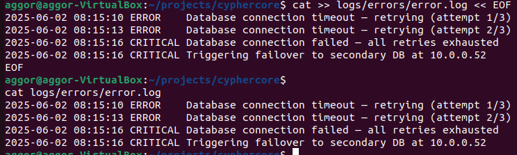
 
**Answers:**
 
**What is a heredoc and what does it solve?**
A heredoc (here document) is a way to pass a multi-line block of text to a command directly within a script or terminal session. It starts with `<<` followed by a delimiter word (commonly `EOF`). Everything typed between the opening and closing delimiter is treated as input. It solves the problem of having to run `echo` once per line - which is tedious, error-prone, and unreadable in scripts with many lines.
 
**Difference between `'EOF'` (quoted) and `EOF` (unquoted):**
 
```bash
DBNAME=cyphercore
 
# Unquoted — variable IS expanded
cat << EOF
Database: $DBNAME
EOF
# Output: Database: cyphercore
 
# Quoted — variable is NOT expanded (literal)
cat << 'EOF'
Database: $DBNAME
EOF
# Output: Database: $DBNAME
```
 
**Screenshot:** 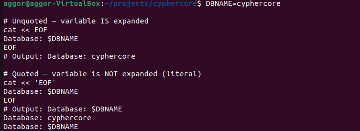
 
With an **unquoted** delimiter, Bash performs variable expansion, command substitution, and arithmetic inside the heredoc - `$DBNAME` becomes `cyphercore`. With a **quoted** delimiter (`'EOF'`), the entire block is treated as a raw string - nothing is expanded, `$DBNAME` prints literally.
 
**Why might someone on a compromised server prefer heredoc over nano/vim?**
Opening an editor like `nano` or `vim` creates a **swap file** (e.g. `.error.log.swp`) and may write to shell history differently. A heredoc executed in a terminal only appears in `.bash_history` as a single command invocation - the multi-line content is less visible to basic forensic history review. Additionally, editors leave behind temporary files and may be logged by auditd at the file-open level. A heredoc writes content in one atomic operation. However, a thorough forensic investigator would still recover the content from memory or audit logs - so this is not true hiding, just reducing obvious traces.
 
---

### Q11 - Open error log using two pager commands (5 marks)
 
**Commands run:**
```bash
more logs/errors/error.log
less logs/errors/error.log
```
 
**Answers:**
 
**Key differences:**
 
| Feature | `more` | `less` |
|---|---|---|
| Scroll direction | Forward only | Forward and backward |
| Loads file into memory | Yes - entirely upfront | No - loads as needed |
| Search | Limited | Yes - `/pattern` |
| Speed on large files | Slow (loads all) | Fast (streams) |
 
**Which loads the entire file into memory first?**
`more` loads the entire file before displaying it. `less` streams the file - it only reads what is needed to display the current screen.
 
**On a server with 512MB RAM and a 3GB log - which do you use?**
`less` - without question. Loading a 3GB file into memory on a 512MB RAM server would cause the system to swap heavily or crash. `less` reads the file lazily, so RAM usage stays low regardless of file size.
 
**Three keyboard shortcuts for `less`:**
 
| Action | Shortcut |
|---|---|
| Search for a pattern | `/searchterm` then Enter; `n` for next match |
| Jump to the end of the file | `G` (capital G) |
| Quit | `q` |

---

## 🟡 SECTION 4 - Move and Clean Up (10 marks)
 
### Q12 — Archive error log and rename access log (4 marks)
 
**Commands run:**
```bash
cp logs/errors/error.log logs/archive/error_2025-06-02.log
mv logs/access/access.log logs/access/access_2025-06-02.log
ls logs/access/ logs/archive/
```
 
**Screenshot:** 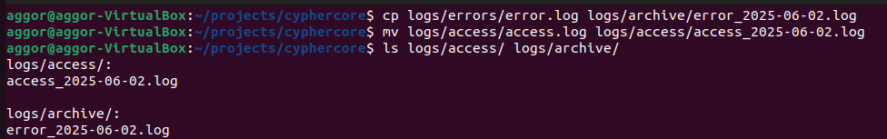
 
**Answers:**
 
**Fundamental difference between `cp` and `mv`:**
- `cp` **copies** - the original file remains at its source path, and a new independent copy is created at the destination.
- `mv` **moves/renames** - the original file ceases to exist at its source path. If moving within the same filesystem, no data is actually duplicated - only the directory entry is updated (it is nearly instantaneous). If moving across filesystems, data is physically copied then the original is deleted.
**After renaming - does the original filename still exist?**
No. After `mv logs/access/access.log logs/access/access_2025-06-02.log`, the filename `access.log` no longer exists. Only `access_2025-06-02.log` exists. Verified with `ls`.
 
**Does copying a large file duplicate all data on disk immediately?**
Yes - `cp` within the same filesystem creates a full physical copy of all data blocks on disk immediately. A 1GB log file costs 1GB of additional disk space the moment `cp` completes. This is different from hard links, which share the same data blocks without duplication.
 
---
 
### Q13 - Remove empty and non-empty directories (3 marks)
 
**Commands run:**
```bash
mkdir reports/temp_drafts
rmdir reports/temp_drafts
rmdir logs/
```
 
**Answers:**
 
**What happened when you tried to remove `logs/`?**
`rmdir` refused with an error: `rmdir: failed to remove 'logs/': Directory not empty`. `rmdir` can only remove directories that are completely empty.
 
**Difference between `rmdir` and `rm -r`:**
- `rmdir` removes **only empty directories**. It is safe by design - it will never accidentally delete files or nested content.
- `rm -r` removes a directory **recursively**, deleting all files and subdirectories inside it along with the directory itself, regardless of content.
**What makes `rm -rf` dangerous and the rule every engineer should follow:**
`rm -rf` combines recursive deletion (`-r`) with force (`-f`, which suppresses all prompts and ignores non-existent files). It will silently and permanently delete everything in the specified path -there is no recycle bin, no undo, no confirmation. A misplaced space or wrong path (e.g. `rm -rf / home/user` instead of `rm -rf /home/user`) can destroy an entire filesystem in seconds.
 
**The rule:** Always double-check the path before running `rm -rf`. Many engineers print the path with `echo` or `ls` first, then replace `echo`/`ls` with `rm -rf` only after confirming it is correct. Never run `rm -rf` as root on a production server without peer review.
 
---
 
### Q14 - Display final tree after cleanup (3 marks)
 
**Command run:**
```bash
tree ~/projects/cyphercore
```
 
**Screenshot:** 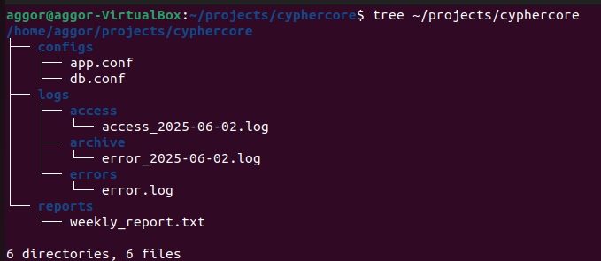
 
**Answers:**
 
**Does the structure match Abena's original sticky note?**
Yes - the core structure matches. The only additions are the archived and renamed log files (`error_2025-06-02.log`, `access_2025-06-02.log`) which were intentional deliverables, not deviations from the spec.
 
**Why does a clean, predictable directory structure matter?**
- **Automation scripts** use hardcoded or config-driven paths. If a directory is missing or misnamed, scripts fail - often silently, writing output to wrong locations or skipping steps entirely.
- **Log agents** (Filebeat, Fluentd, Splunk UF) are configured to watch specific paths. If log files appear in unexpected locations, they are never collected - meaning security events are invisible to the SIEM.
- **Security monitoring tools** (IDS, file integrity monitors like AIDE/Tripwire) baseline the expected structure. Unexpected files or directories trigger alerts. A clean, standard structure means legitimate changes do not generate false positives that drown out real threats.
---
 
##  SECTION 5 - Links and Inodes
 
### Q15 - Write to db.conf, create hard link, list with inodes
 
**Commands run:**
```bash
echo "DB_HOST=10.0.0.10" > configs/db.conf
echo "DB_PORT=5432" >> configs/db.conf
echo "DB_NAME=cyphercore_prod" >> configs/db.conf
ln configs/db.conf configs/db_hardlink.conf
ls -li configs/
```
 
**Screenshot:** 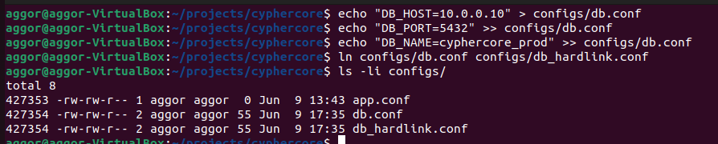
 
**Answers:**
 
**What do you notice about the inode numbers?**
Both `db.conf` and `db_hardlink.conf` share the **exact same inode number**. This confirms they are not two separate files - they are two directory entries pointing to the same underlying data on disk.
 
**What does the link count (third column) represent?**
The link count shows how many directory entries (hard links) currently point to that inode. After creating the hard link, both files show a link count of `2` - meaning two names point to the same data. When a new file is created, its link count starts at `1`.
 
**What is an inode in your own words?**
An inode is a data structure stored by the Linux filesystem that holds all metadata about a file: its size, permissions, owner, timestamps, and the physical disk block addresses where its data lives. It does NOT store the filename - filenames exist in directory entries that point to inodes. Think of an inode as the actual file, and filenames as labels you stick on it. A file can have multiple labels (hard links) - they all lead to the same inode.
 
---
 
### Q16 - Delete original db.conf and read the hard link 
 
**Commands run:**
```bash
rm configs/db.conf
cat configs/db_hardlink.conf
ls -li configs/
```
 
**Screenshot:** 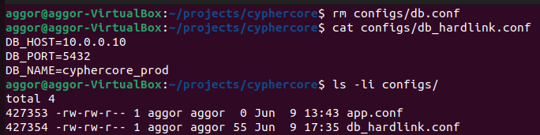
 
**Answers:**
 
**Is the data still there?**
Yes - the data in `db_hardlink.conf` is fully intact and readable even after `db.conf` was deleted.
 
**Why - using inodes and link counts:**
Deleting `db.conf` with `rm` does not destroy the inode or its data. It simply removes that directory entry (that label). The inode still exists because its link count dropped from `2` to `1` - there is still one hard link pointing to it (`db_hardlink.conf`). The filesystem only permanently deletes an inode's data when its link count reaches `0`.
 
**What would need to happen for the data to be permanently deleted?**
Both `db.conf` and `db_hardlink.conf` (all hard links) would need to be deleted. Only when the link count reaches `0` does the filesystem mark those data blocks as free and available for reuse.
 
**What changed in the link count after `rm`?**
The link count on `db_hardlink.conf` dropped from `2` to `1`, reflecting that only one directory entry now points to the inode.
 
**How could an attacker use hard links to hide data on a compromised system?**
An attacker could create a hard link to a malicious file in an obscure, rarely-inspected directory (e.g. deep in `/var/tmp/` or inside a system directory), then delete the "visible" copy. Security scans and file integrity checks that look for files by path would not find it. The data persists invisibly until all links are removed. Detecting this requires scanning inode link counts - files with unexpectedly high link counts in sensitive directories are a forensic red flag.
 
---
 
### Q17 - Create symlink, delete original, read broken link (5 marks)
 
**Commands run:**
```bash
echo "APP_ENV=production" > configs/app.conf
echo "APP_PORT=8080" >> configs/app.conf
ln -s configs/app.conf ~/projects/cyphercore/app_config_link
ls -la ~/projects/cyphercore/
rm configs/app.conf
cat ~/projects/cyphercore/app_config_link
```
 
**Screenshot (listing + failed read):** 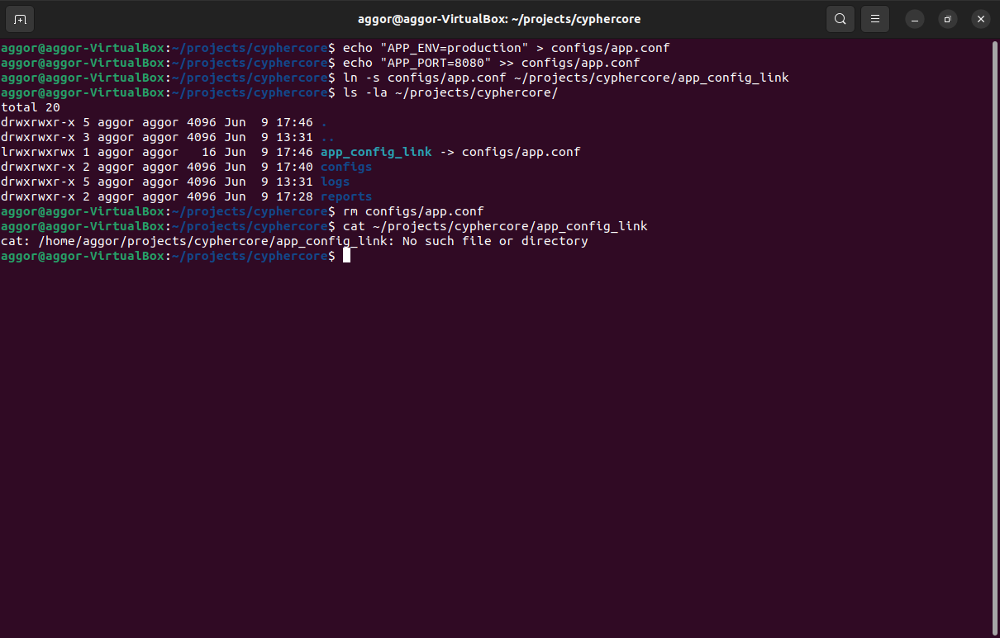
 
**Answers:**
 
**What character identifies a symbolic link in the listing?**
The letter `l` at the start of the permission string (e.g. `lrwxrwxrwx`). The listing also shows the link target with an arrow: `app_config_link -> configs/app.conf`.
 
**What happened when you read the broken link?**
The read failed with an error: `cat: app_config_link: No such file or directory`. This is called a **dangling symlink** (or broken/orphaned symlink).
 
**Why does a dangling symlink cause hard-to-debug failures at 2 AM?**
A dangling symlink looks completely normal in a directory listing - it exists, it has a name, it shows a target path. Nothing visually warns you it is broken until you try to use it. In a deployment pipeline, if a symlink points to a config file that was moved or deleted during a deployment step, the application starts, finds the symlink, attempts to read it, and fails - often with a vague "file not found" error that points to the symlink's target path, not the symlink itself. Tracing the error back to the symlink at 2 AM under pressure, without knowing the codebase, is exactly the kind of failure that takes hours to diagnose.
 
---
 
### Q18 - Hard link vs Soft link comparison table
 
| Property | Hard Link | Soft Link |
|---|---|---|
| Shares inode with original? | Yes - same inode number |  No - has its own inode |
| Works across different filesystems? |  No - inodes are filesystem-specific |  Yes - stores a path, not an inode |
| Survives deletion of original? |  Yes - data persists until link count = 0 |  No - becomes a dangling symlink |
| Can link to a directory? |  No (restricted by most Linux filesystems) |  Yes |
| Shows as `l` in `ls -la`? |  No - looks like a regular file |  Yes |
| Detectable by matching inodes in `ls -li`? |  Yes - identical inode numbers |  No - different inode from target |
 
**Real-server use cases in a DevSecOps context:**
 
**Hard link use case:** Log archiving without duplication. A SIEM agent is configured to read logs from `/var/log/app/current.log`. When logs are rotated, instead of copying the file (wasting disk space), the rotation script creates a hard link at `/var/log/app/archive/2025-06-02.log` pointing to the same inode. The SIEM continues reading the data through its original path while the archive link preserves the content - zero additional disk usage until rotation is complete.
 
**Soft link use case:** Version-controlled application deployments. When deploying a new version of an application, the new code is extracted to `/opt/app/v2.1.0/`. A symlink `/opt/app/current` points to the active version. Switching from `v2.0.0` to `v2.1.0` is a single atomic command: `ln -sfn /opt/app/v2.1.0 /opt/app/current`. Rollback is equally instant. All services, scripts, and monitoring tools reference `/opt/app/current` — they automatically follow the symlink to whichever version is live.
 
---
 
## SECTION 6 - Data Streams and Redirection
 
### Q19 - Redirect stdout and stderr to separate files
 
**Command run:**
```bash
ls logs/ /nonexistent_path 1> reports/stdout_output.txt 2> reports/stderr_output.txt
cat reports/stdout_output.txt
cat reports/stderr_output.txt
```
 
**Screenshot:** 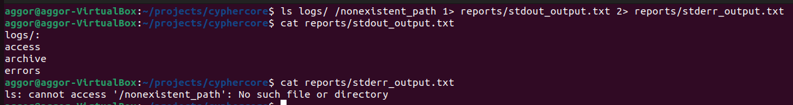
 
**Answers:**
 
**Which content landed where and why?**
- `reports/stdout_output.txt` contains the directory listing of `logs/` - this is normal output (stream 1) because `logs/` exists and `ls` successfully listed it.
- `reports/stderr_output.txt` contains the error message for `/nonexistent_path` - this is error output (stream 2) because the path does not exist, so `ls` wrote the error to stderr, not stdout.
**The three streams:**
 
| Stream | Number | Carries |
|---|---|---|
| stdin | 0 | Input to a process (keyboard, pipe, file) |
| stdout | 1 | Normal output from a process |
| stderr | 2 | Error messages and diagnostics from a process |
 
**What does `2>` mean specifically?**
`2>` redirects **stream 2 (stderr)** to a file. It is equivalent to writing `2> filename` - any error messages the command produces go to that file instead of the terminal.
 
**`2>&1` explained:**
`2>&1` means "send stream 2 (stderr) to wherever stream 1 (stdout) is currently going." It merges error output into the normal output stream. Used in deployment scripts with piped commands like `command 2>&1 | tee deploy.log` - this ensures both normal output and errors are captured in the log file, so you never miss an error that "bled" onto the screen while stdout was being redirected elsewhere.
 
---
 
### Q20 — Write weekly report using heredoc (5 marks)
 
**Command run:**
```bash
cat > reports/weekly_report.txt << 'EOF'
========================================
WEEKLY SECURITY REPORT — CypherCore Systems
Week Ending: 2025-06-06
Prepared By: Emmanuel
========================================
 
SUMMARY:
No critical incidents recorded this week.
One WARN: memory usage spike at 08:14 on 2025-06-02.
One CRITICAL: DB connection failure at 08:15 on 2025-06-02.
Failover to secondary DB executed successfully.
 
RECOMMENDED ACTION:
Review DB connection pool settings before next deployment.
========================================
EOF
cat reports/weekly_report.txt
```
 
**Screenshot:** 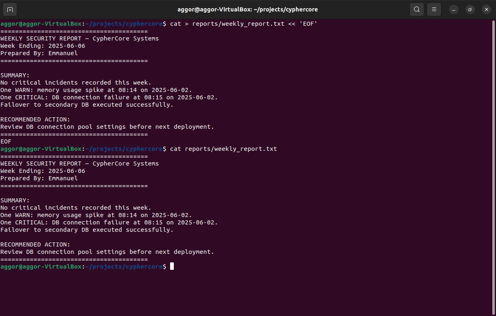
 
**Answers:**
 
**Did you quote the delimiter or not - and why?**
I used a **quoted** delimiter (`'EOF'`) because the report content is a static template with no variables that need expanding. Quoting prevents Bash from accidentally interpreting any `$` characters or backticks in the report text as variable/command substitutions - the report prints exactly as written.
 
**Quoted vs unquoted heredoc with a variable:**
 
```bash
ANALYST="Emmanuel"
 
# Unquoted — variable IS expanded
cat << EOF
Analyst: $ANALYST
EOF
# Output: Analyst: Emmanuel
 
# Quoted — variable NOT expanded
cat << 'EOF'
Analyst: $ANALYST
EOF
# Output: Analyst: $ANALYST
```
 
**Screenshot:** 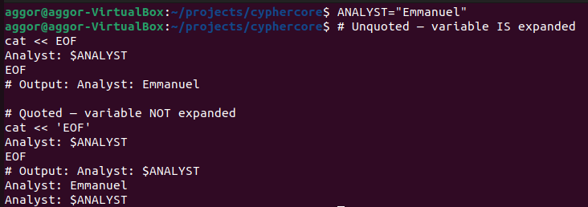
 
**When to use each in a real script:**
 
- **Quoted heredoc** - use when writing configuration files, templates, or any content that should be treated as literal text. Example: generating an nginx config block where `$uri` is a literal nginx variable, not a shell variable.
  ```bash
  cat > /etc/nginx/sites-available/app << 'EOF'
  location / {
      try_files $uri $uri/ =404;
  }
  EOF
  ```
 
- **Unquoted heredoc** - use when the content needs to include dynamic values from the current shell environment. Example: writing a deployment summary with the actual server hostname and timestamp.
  ```bash
  HOSTNAME=$(hostname)
  TIMESTAMP=$(date)
  cat >> /var/log/deploy.log << EOF
  Deployment completed on $HOSTNAME at $TIMESTAMP
  EOF
  ```
 
---
 
### Q21 - Final tree and reflection 
 
**Command run:**
```bash
tree ~/projects/cyphercore
```
 
**Screenshot:** 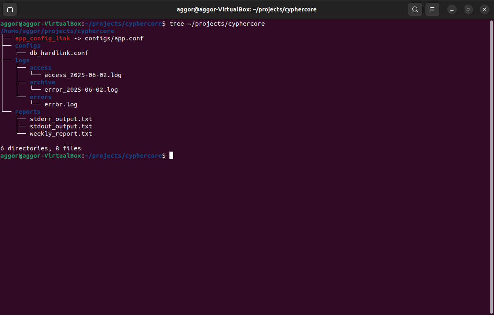
 
**Answers:**
 
**How does everything built today connect to real DevSecOps work?**
 
The directory structure we built mirrors what a real deployment pipeline expects — configs, logs, archives, and reports each in designated locations. The log files we wrote simulate what application logging looks like in production: structured entries with timestamps, severity levels, and event descriptions that a SIEM would ingest and alert on. The archive we created reflects actual log rotation practices that keep servers from running out of disk space. The symbolic links replicate how modern deployment tools (Capistrano, Ansible) manage version switching. The stream redirection exercise is exactly how CI/CD pipelines separate build output from errors in deployment logs.
 
**Two commands that changed how I think about Linux:**
 
1. **`ln` (hard links)** - Before this, I thought deleting a file always deleted the data. Understanding that a filename is just a pointer to an inode - and that data survives until all pointers are removed - completely changed how I think about filesystem forensics. As a SOC analyst investigating a compromised server, I now know to check inode link counts and not just search by filename. An attacker can hide persistent data in plain sight using hard links.
2. **`2>&1`** - I had seen this in scripts before and never understood it. Now I know that stdout and stderr are separate streams, and that most basic redirection only captures one of them. In every deployment script, monitoring script, or incident response tool I write from now on, I will deliberately think about where errors are going - because silent stderr is how critical failures get missed in production at 3 AM.
---
 
*Submitted as part of the ParoCyber DevSecOps Bootcamp - LetsLearnLinux1 Assignment*
